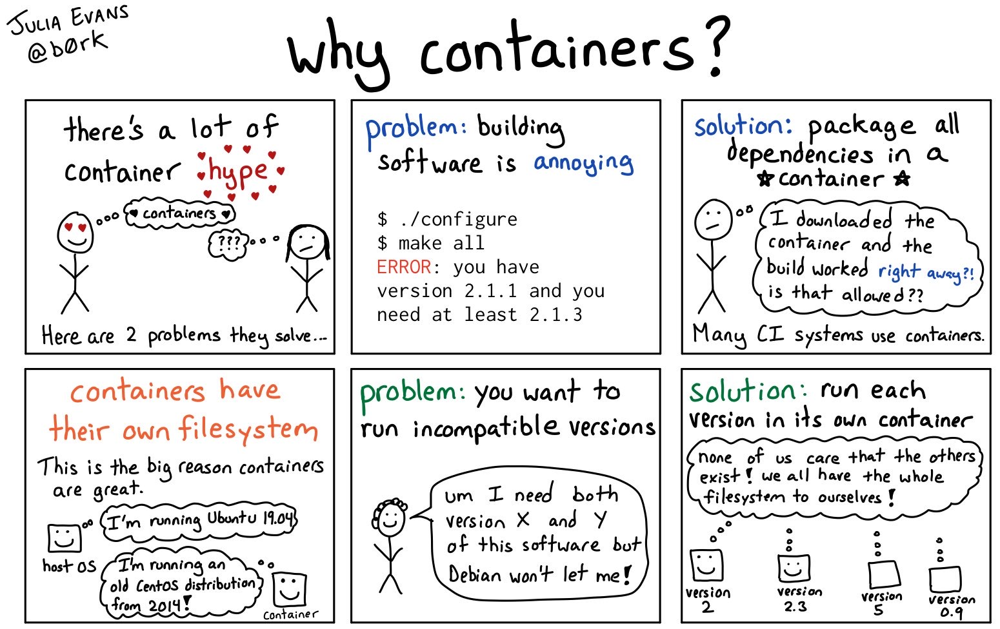
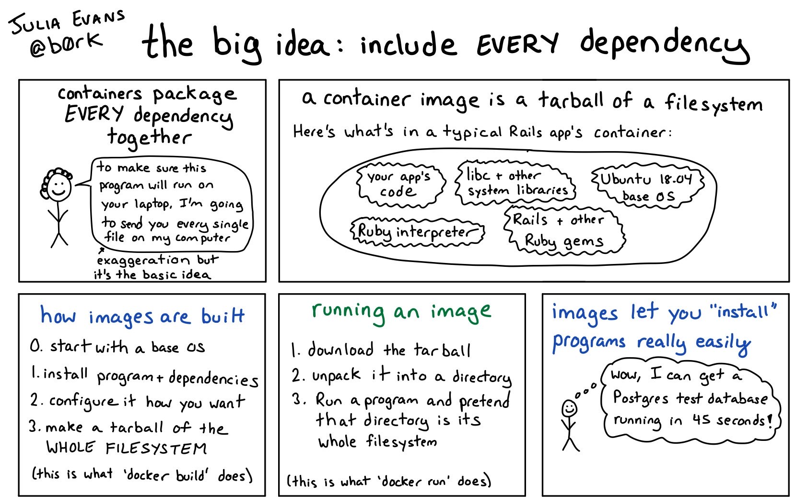
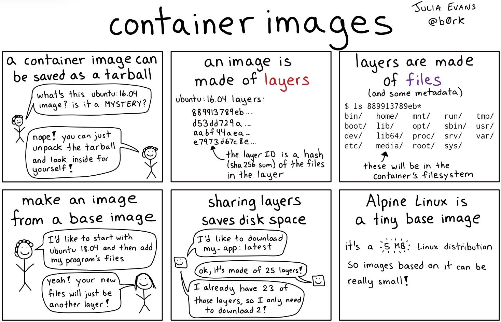
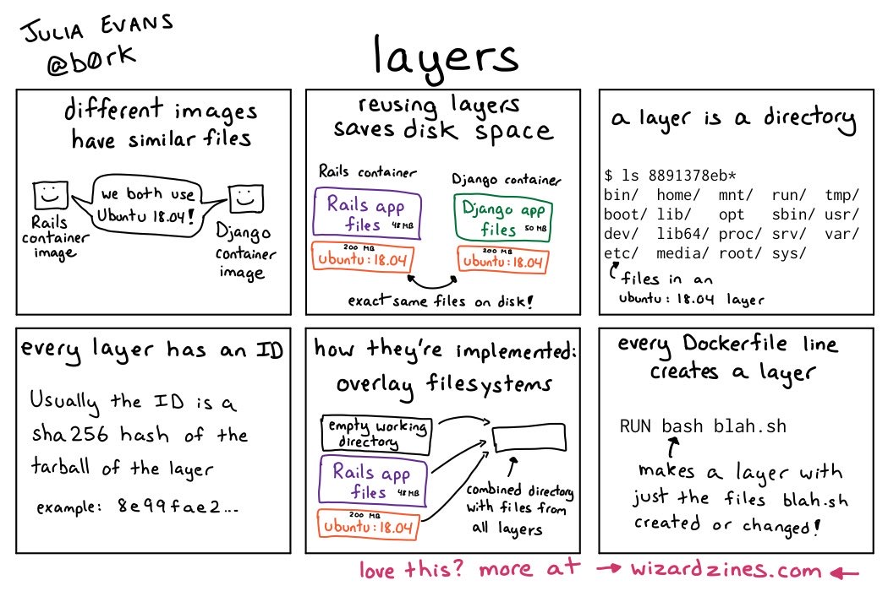

<!-- Run this slideshow via the following command: -->
<!-- reveal-md README.md -w -->

<!-- .slide: data-background="./../Slides/images/header.svg" data-background-repeat="none" data-background-size="40% 40%" data-background-position="center 10%" class="header" -->
# 📜 Day 7: Docker Concepts in Practice

<!-- > -->

## 🏆 Objectives

1. Expand existing knowledge of common bash commands.
1. Create a `Dockerfile` that installs a dependency and runs several bash commands.

<!--
|   Level   | Verbs |
| --------- | ----- |
| 6: Create | design, formulate, build, invent, create, compose, generate, derive, modify, develop |
| 5: Evaluate | choose, support, relate, determine, defend, compare, contrast, justify, support, convince, select |
| 4: Analyze | classify, break down, categorize, analyze, diagram, illustrate, criticize, simplify, associate |
| 3: Apply | calculate, predict, apply, solve, illustrate, use, demonstrate, determine, model, perform, present |
| 2: Understand | describe, explain, paraphrase, restate, summarize, contrast, interpret, discuss |
| 1: Remember | list, recite, outline, define, name, match, quote, recall, identify, label, recognize |
-->

<!-- > -->

## 👩‍🏫 TT - Docker: From Concept to Practice

### Buying the Premise

### Why We Use Containers

### Containers Are Made of Layers

### 1 Line in Dockerfile = 1 Layer

`TODO`

<!-- > -->

## 📚 Resources

`TODO`

<!-- > -->

## 🙏 Credits

- [Julia Evans (@bork)](https://twitter.com/b0rk): _Photo credit for comics used in lesson plan._
